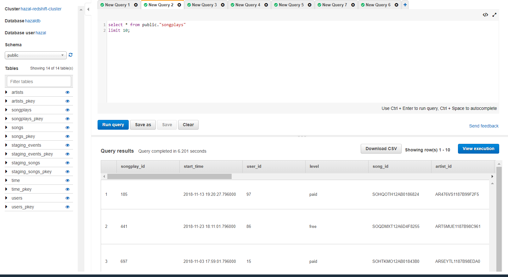
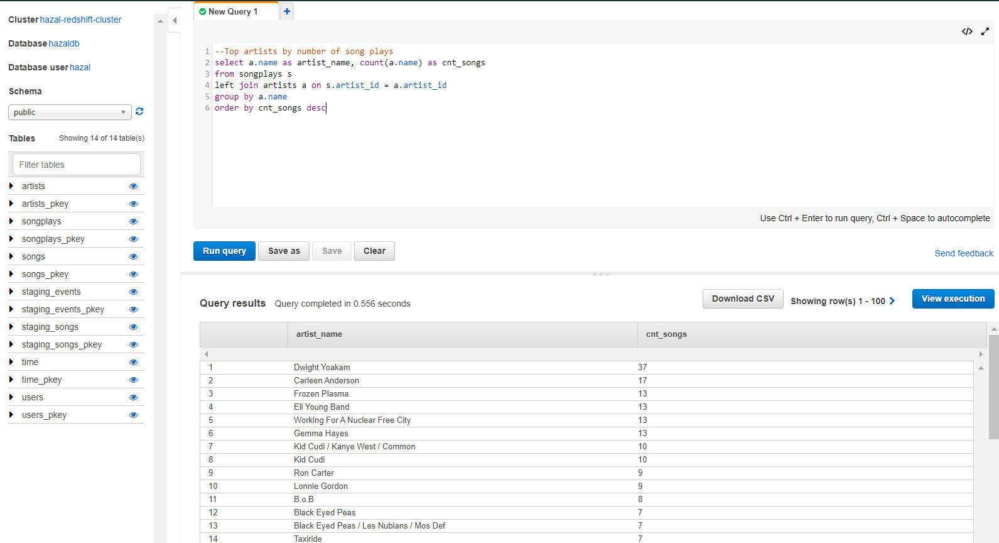

# Cloud Data Warehouse AWS

##### (Udacity Data Engineer Nano Degree Project 3)
---------------

**Introduction**

This Udacity Data Engineering nanodegree project creates an cloud Data Warehouse by using AWS and ETL process for a music app, Sparkify. 

**The Goal**

The purpose of this project is, understanding of Data warehousing concepts. 

The task includes facilitating the Sparkify start up in setting up a data warehouse that would have the songs data to which the users are listening to. This would help Sparkify analyze the user activities.

The ETL and data warehouse has been built on AWS, with a PostgreSQL database and staging tables hosted on Amazon Redshift, pulling data from Amazon S3.  The scripts have been created in Python.

#### In this project Redshift dc2.large cluster with 8 nodes has been created

**Database Source**

The source data is in log files given the Amazon s3 bucket:

- Song data: s3://udacity-dend/song_data
- Log data: s3://udacity-dend/log_data
- Log data json path: s3://udacity-dend/log_json_path.json

Log files contains songplay events of the users in json format while song_data contains list of songs details.

**Structure**

The analytics tables have been arranged in a star schema.

The **songplays** table is the fact table and it contains foreign keys to dimension tables.

- start_time 
- user_id
- song_id
- artist_id 

There are also two staging tables

The project contains the following components:

- **create_tables.py** creates the Sparkify star schema in Redshift
- **etl.py** defines the ETL pipeline, extracting data from S3, loading into staging tables on Redshift, and then processing into analytics tables on Redshift
- **sql_queries.py** defines the SQL queries that underpin the creation of the star schema and ETL pipeline

**Data Pipeline** 

In this project most of ETL is done with SQL:

- Firstly staging tables have been loading from S3 sources. 
- From these tables fact and dimension tables are getting  data from the staging tables.

check out the sql_queries.py

**To run the program**

- python create_tables.py must be runned first

- python etl.py will execute for data loading

**Query Examples**

-----
NOTE: End of the project cluster has been deleted

Hazal Ciplak
